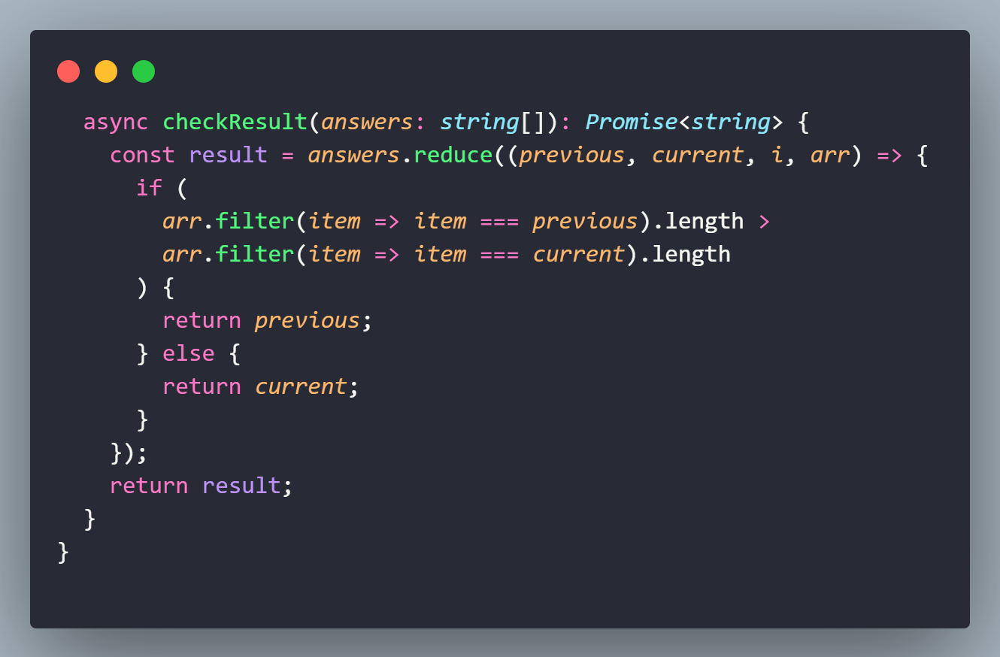

## 🏋️‍♂️ Projeto Angular + TypeScript + CSS .

Desafio de projeto proposto para criação de clone da página do BuzzFeed. 

Os temas abordados são: 
- Componentes do Angular.
- Criação de elementos dinamicamente. 
- ngFor e ngIf.
- Método reduce. 

## Funcionalidades:

- Escolha de opções.
- Exibição do resultado de acordo com as escolhas do usuário.

## 💻 Tecnologias utilizadas nesse projeto:

  
  
  
  

## Estrutura do Projeto:

- **index.html:** Arquivo HTML principal.
- **styles.css:** Arquivo CSS global.
- **src/**
    - **app/**
        - **components/**
          - **quizz/**
              - **quizz.component.css:** Arquivo CSS contendo a estilização do componente.
              - **quizz.component.html:** Arquivo com a estrutura HTML do componente.
              - **quizz.component.ts:** Arquivo Typescript responsável pela lógica do componente. 
    - **assets/**
        - **data/**
            - **quizz_questions.json:** Arquivo JSON com os dados das perguntas, respostas e resultados.

## Resumo `reduce()`:

O método reduce em TypeScript (assim como em JavaScript) é um método de array que aplica uma função de redução a cada elemento do array (da esquerda para a direita), resultando em um único valor final. Ele é extremamente útil para operações de agregação, como somar valores, concatenar strings, ou transformar um array em um objeto.

A sintaxe básica do reduce é:

`array.reduce(callback, initialValue)`

callback: Uma função que é executada em cada valor do array, levando quatro argumentos:

- accumulator: O valor acumulado retornado na última invocação do callback, ou initialValue, se fornecido.
- currentValue: O valor do elemento atual do array.
- currentIndex: O índice do elemento atual do array.
- array: O array sobre o qual reduce foi chamado.
  
initialValue (opcional): Um valor a ser usado como o primeiro argumento para a primeira chamada do callback. Se não fornecido, o primeiro elemento do array será usado e callback começará com o segundo elemento.

**Explicação da Função checkResult:**

Parâmetro answers:

Recebe um array de strings (answers) que contém as respostas selecionadas pelo usuário.

Parâmetros do Callback reduce:

- previous: O valor acumulado das iterações anteriores (inicialmente o primeiro elemento do array). 
- current: O valor do elemento atual do array. 
- i: O índice do elemento atual no array (não é usado neste caso). 
- arr: O array original (answers). 

Lógica:

- Para cada elemento do array, a função reduce compara a frequência do previous com a frequência do current. 
- arr.filter(item => item === previous).length: Conta quantas vezes o previous aparece no array. 
- arr.filter(item => item === current).length: Conta quantas vezes o current aparece no array. 
- Se a frequência do previous for maior, previous é mantido. 
- Se a frequência do current for maior ou igual, current substitui previous. 

Resultado Final:

O valor final de reduce é a resposta mais frequente no array answers.
Esse valor é retornado pela função checkResult.

A função checkResult é acionada por nextStep (em quizz.component.ts) quando chegar ao limite de perguntas.

## 💻 Preview:

- Veja como ficou o projeto acessando: [Link]()
  

## 📌 Créditos:
- **Curso:** ✨ Criando um Clone do BuzzFeed com Angular:
[Formação Angular Developer - DIO](https://web.dio.me/track/formacao-angular-developer)

